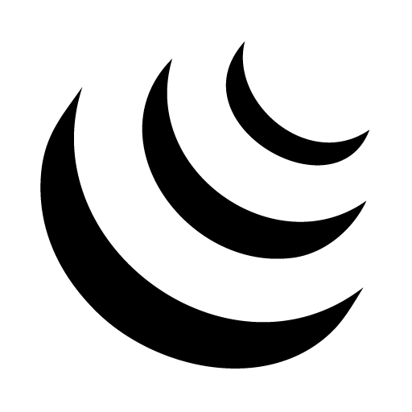
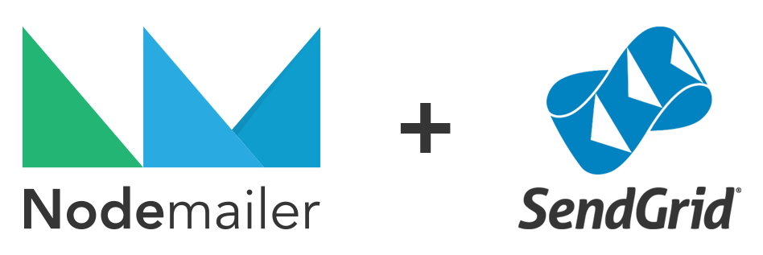

# MENP
<!--[](https://nodei.co/npm/menp/)-->
<!--[](https://github.com/facebook/jest)-->
[](http://inch-ci.org/github/Berkmann18/MENP)
[](https://nodesecurity.io/orgs/berkmann18/projects/fd479365-365e-4a75-9a25-ba37e69f9780)
[](https://codecov.io/github/Berkmann18/MENP?branch=master)
[](https://www.bithound.io/github/Berkmann18/MENP)
[](https://www.bithound.io/github/Berkmann18/MENP/dev/dependencies/npm)
[](https://www.bithound.io/github/Berkmann18/MENP/master/dependencies/npm)
[](https://www.bithound.io/github/Berkmann18/MENP)
[](https://david-dm.org/Berkmann18/MENP)
[](https://github.com/Berkmann18/MENP/issues)
<!--[](https://npmjs.org/package/menp)-->

This is a sample MENP (MongoDB, Express, Node, Pug) web app (which uses Bootstrap and jQuery).

<table>
<tr><td>






</td></tr>
</table>

Basically:

- MongoDB for the database
- [NodeJS] and Express for the server
- Pug for the view rendering and templating
- Boostrap for the UI
- jQuery and Cheerio for a sped up DOM access on both client and server sides
- NodeMailer + SendGrid for the emails
- Passport for the authentication

# Install
```cli
git clone http://github.com/Berkmann18/MENP.git
```

# Contributing
Make sure you follow the stick to the coding style enforced by the linters, and that you test your code before making a pull request.
Feel free to make any suggestions and report bugs.

# License
MIT

[NodeJS]: http://nodejs.org
[NPM]: http://www.npmjs.com